# Governed model improvement platform

## Decision

Lightwork will build the governance and evaluation substrate for specialist
models now, while keeping real GPU training demand-driven. The platform is
vendor-neutral: Prime Intellect is a strong optional training backend, not an
architectural dependency and not a trust boundary.

The near-term product is not "we train a foundation model." It is:

> Every legally usable, human-reviewed decision can become a provenance-bound
> evaluation or training signal. A specialist artifact is adopted only when it
> beats the configured baseline on a sealed holdout, passes deterministic
> safety and deployment qualification, carries an externally verifiable
> receipt, and receives explicit human authority.

That gives Lightwork a credible route to lower inference cost, lower latency,
air-gapped deployment, and a proprietary per-customer learning loop without
claiming results that have not been measured.

## What is implemented

| Layer | Current implementation | Honest status |
|---|---|---|
| Environment contract | `maverick.training.environments` | Built and deterministic |
| Seed environments | PIA scoring, DSAR routing, Article 28 clause review | Built for integration/bakeoff; deliberately not promotion-grade |
| Taskset integrity | Raw-file and semantic-digest lock, split/family isolation, sealed-answer rules | Built |
| Data boundary | Exact-schema consent, expiry/revocation/retention metadata, tenant isolation, externally trusted and content-bound redaction evidence | Built; detector evidence is not a universal de-identification proof, and deletion execution remains an operator control |
| Reward | Strict JSON, exact result shape, exact source-span citations, separate reason codes | Built; no LLM judge |
| Candidate catalog | Immutable upstream and artifact-repository revisions, exact runtime formats, official-source facts | Built as research input, never a router |
| Deployment planning | Conservative memory/context/concurrency estimates | Built; estimates are not benchmarks |
| Qualification | Current catalog candidate plus exact base/adapter/tokenizer/runtime/hardware tuple with quality, safety, calibration, latency, throughput, memory, cost, and freshness gates | Built; policy floors cannot be weakened and no model has passed until a real run supplies measurements |
| Training receipt | Tenant-private, hash-chained, digest-bound run evidence with separate human and platform signatures and minimal public commitment | Built; verification checks the full store prefix, while signed tail rollback needs an externally published latest commitment |
| Model Risk connection | Training evidence is part of the weights-change assurance path | See Model Risk section and tests |
| External backend | Version-pinned, non-executing export/run specifications | Optional operator path; never auto-installs or uploads |
| Real specialist weights | None claimed | Requires customer-authorized data, sealed holdout, GPU run, and approval |

## Architecture

```mermaid
flowchart LR
    A["Human-reviewed work product"] --> B["Consent and provenance admission"]
    B --> C["Tenant-local environment pack"]
    C --> D["Locked train / validation / sealed holdout splits"]
    D --> E["Base-model bakeoff"]
    D --> F["Optional training backend"]
    E --> G["Exact runtime and hardware qualification"]
    F --> G
    G --> H["Signed training and evaluation receipt"]
    H --> I["Model Risk evidence and human authorization"]
    I --> J["Weights-rung promotion transaction"]
    J --> K["Canary serving through role-model routing"]
    K --> L["Acceptance, cost, latency, drift, and rollback telemetry"]
    L --> A
```



The environment, receipt, qualification, and promotion contracts are Lightwork
contracts. A Prime, local DPO/QLoRA, or future training implementation plugs in
below them.

## Data and privacy boundary

### Allowed in v1

- Public synthetic tasks for integration and base-model bakeoffs.
- One tenant's data in a tenant-local run when every human/non-public case has:
  an exact consent record, allowed purpose, tenant, approval authority, expiry,
  revocation state, retention term, and bound redaction evidence, and both
  evidence records match a separately supplied trusted-evidence registry.
- Hosted training only when the feature and hosted sub-control are enabled and
  every tenant-derived case is classified public, scoped specifically for
  hosted training, unexpired, unrevoked, and accompanied by reviewed redaction
  evidence.

### Refused in v1

- Cross-tenant datasets, adapters, or weight aggregation.
- Treating a LoRA delta as anonymized data.
- Raw prompt, completion, document, or transcript content in receipts or public
  transparency records.
- Published holdout answers as promotion evidence.
- A consent string containing the word "training" instead of an exact purpose.
- A redaction status string without detector/input/output evidence and human
  review.
- Consent or redaction evidence whose case, environment, tenant, admitted
  content, or canonical output digest does not match the exported row.
- Hosted upload merely because a third-party SDK defaults to it.

`federation.py` is authenticated agent delegation, not federated learning.
`fleet_memory.py` is tenant-isolated experience storage, not secure aggregation.
A future fleet model needs a separate design: legal opt-in, minimum cohorts,
authenticated update provenance, clipping, secure aggregation, differential
privacy accounting, poisoning/Byzantine defenses, memorization testing, and
rollback. It is not an incremental configuration switch.

## Environment design

The three initial environments map to existing deterministic Lightwork engines:

1. **Privacy Impact Assessment scoring** — structured answer map to inherent
   risk, residual risk, and findings.
2. **DSAR detection and routing** — request classification, type, route, and
   deadline.
3. **GDPR Article 28 clause review** — present, missing, and unclear requirement
   keys.

Every answer is strict JSON. Citations use `{source_id, quote, start, end}` and
must match the exact source-evidence region, not prompt instructions. Missing
or unclear requirements use separate deterministic reason codes.

Trainer exports contain only the `train` split. Validation and holdout bundles
are evaluation-only and are refused by training run specifications. The shipped
packs have three train, three validation, and three holdout
families. Their answers are public in the wheel, so the promotion gate
deliberately reports them as not ready. A promotion taskset needs at least 20
independent train families and 20 independent sealed holdout families by
default; production programs should raise those floors based on error cost.

## Specialist-model candidate matrix

This is a bakeoff queue, not a winner declaration. Sizes are published artifact
sizes captured in the versioned catalog; Lightwork still requires a signed file
manifest and live qualification on the exact serving stack.

| Candidate | Exact catalog format | Published weights | Initial role | Position |
|---|---:|---:|---|---|
| Granite 4 Micro | GGUF Q4_0 | 2.10 GiB | extraction, routing | Small edge floor |
| Granite 4 H-Tiny | GGUF Q4_0 | 4.23 GiB | extraction, routing, tools | Efficient hybrid comparison |
| Gemma 4 E4B | GGUF Q4_0 | 5.15 GiB | drafting, extraction, routing | Edge primary |
| Ministral 3 8B | GGUF Q4_0 | 5.20 GiB | drafting, extraction, routing | Edge primary |
| Gemma 4 12B | GGUF Q4_0 | 6.98 GiB | drafting, reviewer | Single-GPU primary |
| Ministral 3 14B | GGUF Q4_0 | 8.24 GiB | drafting, reviewer | Single-GPU comparison |
| gpt-oss-20b | safetensors MXFP4 | 12.81 GiB | reviewer, tools | Primary; Harmony integration required |
| Gemma 4 26B-A4B | GGUF Q4_0 | 14.40 GiB | drafting, reviewer | Quality upper bound |
| Nemotron 3 Nano 30B-A3B | safetensors NVFP4 | 18.01 GiB | reviewer, tools | NVIDIA upper bound |
| Qwen 3.5 9B | safetensors BF16 | 17.98 GiB | drafting, extraction, reviewer | Adapter primary; qualify an exact INT4 artifact separately |
| Qwen 3.5 35B-A3B | safetensors GPTQ INT4 | 22.74 GiB | drafting, reviewer | Quality upper bound; not a safe 24 GiB production fit |

Also tracked: Qwen 3.5 4B and Phi-4 Mini as dense small-model comparisons. The
versioned source catalog contains exact model/repository revisions, licenses,
model-card links, roles, and caveats.

Primary sources:
[Qwen](https://huggingface.co/Qwen),
[OpenAI gpt-oss](https://openai.com/index/gpt-oss-model-card/),
[Google Gemma](https://huggingface.co/google),
[Mistral](https://huggingface.co/mistralai),
[IBM Granite](https://huggingface.co/ibm-granite),
[Microsoft Phi](https://huggingface.co/microsoft/Phi-4-mini-instruct), and
[NVIDIA Nemotron](https://huggingface.co/nvidia/NVIDIA-Nemotron-3-Nano-30B-A3B-BF16).

### Bakeoff metrics

A model is judged on the work product, not a generic leaderboard:

- exact schema pass rate;
- task pass rate and high-cost false-negative rate;
- citation precision/recall and source-span validity;
- calibration error and correct abstention;
- tool name and argument validity;
- first-pass human acceptance, edit distance, and rejection reasons;
- jailbreak blocking and memorized-PII reproduction;
- quantization quality loss against the exact higher-precision baseline;
- time to first token, decode throughput, peak memory, requests per second,
  and cost at the target context and concurrency;
- heldout lift from the adapter versus the same exact base artifact.

The default qualification policy is intentionally strict and versioned.
Operator policy may tighten it but cannot weaken the shipped profile floor.
Evidence older than 30 days or more than five minutes in the future is refused.
The catalog digest, candidate id, immutable model repository revision, exact
base format, base bytes/manifest/tokenizer, adapter bytes/checkpoint/runtime
compatibility, deployment manifest, runtime lock, hardware, context, and
concurrency are all bound. Edge, standard, and throughput profiles differ only
in measured deployment constraints; none relaxes the safety/quality floor.

## Prime Intellect integration

Lightwork targets explicit compatibility profiles, pinned exactly:

- [prime-rl v0.7.0](https://github.com/PrimeIntellect-ai/prime-rl/tree/d334ea52940b47f426293a7d146239e3fbf91caa)
  at commit `d334ea52940b47f426293a7d146239e3fbf91caa`, with its bundled editable
  [Verifiers v0.2.0 submodule](https://github.com/PrimeIntellect-ai/verifiers/tree/6c64ce6a3a01e8edde7c3c0e8e5315fb236e9faa)
  at commit `6c64ce6a3a01e8edde7c3c0e8e5315fb236e9faa`.
- Standalone [Verifiers v0.2.1](https://github.com/PrimeIntellect-ai/verifiers/tree/ab65b6e8d34b03d162408d4bcb854430a86809e6)
  at commit `ab65b6e8d34b03d162408d4bcb854430a86809e6`
  is a separate evaluation profile. A prime-rl run refuses that bundle.

Verifiers models an environment as tasksets plus harness/reward functions.
prime-rl is an asynchronous multi-process training system; it is not compatible
with the synchronous preference-pair `adapter_rung.Trainer` protocol. Lightwork
therefore uses a separate training-backend lifecycle with prepare, status,
cancel, and resume semantics.

The integration:

- creates a self-contained, content-addressed environment bundle whose verified
  `src` directory is exposed only through the run specification's isolated
  `PYTHONPATH`; inherited caller `PYTHONPATH` values are discarded, the Prime
  entrypoint uses Python safe-path mode, and child interpreters inherit
  `PYTHONSAFEPATH=1` plus `PYTHONNOUSERSITE=1`;
- generates train-only trainer bundles and separate evaluation-only bundles;
- ships the exact deterministic scorer source inside the bundle, commits its
  bytes in the runtime lock, and verifies those bytes before execution without
  depending on an ambient Lightwork installation;
- emits exact argv and configuration for an operator-provisioned workspace;
- selects the environment with Prime v0.7's Verifiers v1
  `taskset = { id = ... }` configuration shape;
- revalidates the source pack, protected active-tenant evidence registry,
  boundary decision, tenant/target admission, and every materialized file at
  prepare and resume;
- disables upload/telemetry and strips non-allowlisted environment variables by
  default;
- never runs a remote installer, installs from `main`, or executes a shell;
- records the backend version/commit, lock/container, config, egress policy,
  checkpoints, metrics, and output artifact in the training receipt.

Prime hosted training is useful when the customer contract and consent boundary
permit it. Local Prime, local DPO/QLoRA, or another backend remains available
for sovereign deployments.

## Promotion lifecycle

1. Admit cases under the exact tenant and consent boundary.
2. Lock the taskset; prove family separation and hide holdout answers.
3. Run the same base artifact against the deterministic environments.
4. Train per tenant, never across tenants in v1.
5. Evaluate the candidate on the sealed holdout and adversarial suites.
6. Qualify the exact base, adapter, tokenizer, runtime, lock, deployment
   manifest, and hardware tuple against the non-weakenable policy floor.
7. Produce the content-free training receipt and obtain the independent human
   approval signature.
8. Register the verified receipt digest as Model Risk evidence.
9. Require current training-run, data-assessment, evaluation, red-team, and
   promotion authority for a weights change.
10. Use the existing PREPARE/CAS/COMMIT adapter promotion and rollback path.
11. Canary the model through existing role routing; do not silently replace a
    configured role model.
12. Monitor acceptance, safety, drift, latency, cost, and rollback triggers.

## Roadmap

### Phase 0 — foundation

Status: implemented.

- Vendor-neutral environments and deterministic rewards.
- Structured consent/redaction/data-boundary enforcement.
- Locked public seed packs.
- Evidence-labelled model catalog and deployment estimator.
- Qualification gate.
- Signed training receipts.
- Default-off configuration and installer controls.
- Optional external-backend export specifications.

Exit criteria: focused tests, wheel-content verification, Ruff, and full-suite
regression pass.

### Phase 1 — first design-partner corpus

- Pick one work product: PIA scoring is the recommended first environment.
- Contract for allowed purpose, retention, deletion, hosting, and derived
  artifacts.
- Collect real reviewer accept/edit/reject signals and reason codes.
- Build at least 20 independent train families and 20 separately authored
  sealed holdout families; target hundreds of cases before expecting stable
  training lift.
- Establish reviewer agreement and adjudication before labels become ground
  truth.

Exit criteria: counsel/privacy approval, taskset lock, contamination check,
label-quality report, and baseline measurements.

### Phase 2 — base-model bakeoff

- Run edge, single-GPU, and upper-bound candidates on the exact same sealed
  protocol.
- Eliminate candidates on quality/safety before optimizing cost.
- Select one dense primary and one upper-bound reference per work product.

Exit criteria: reproducible qualification records on target deployment
hardware, with no model silently marked "best."

### Phase 3 — per-tenant specialist adapter

- Start with supervised or DPO/QLoRA where deterministic labels and reviewer
  preferences support it.
- Use online RL only where an interactive task/harness actually warrants it.
- Compare base versus adapter with confidence intervals and quantization loss.

Exit criteria: statistically credible heldout lift, no safety regression,
signed receipt, Model Risk approval, and one-step rollback.

### Phase 4 — serving and economics

- Canary by role and tenant through existing routing.
- Measure first-pass acceptance, review time, latency, cost, and incident rate.
- Roll back automatically on technical health failures; require human authority
  for model-risk decisions.

Exit criteria: sustained service objective and a customer-validated margin
improvement.

### Phase 5 — additional work products

Recommended order:

1. DSAR routing.
2. Article 28 clause review.
3. Control/evidence classification.
4. Regulatory-change triage.
5. Finance anomaly disposition support.
6. Sanctions-case narrative support, never autonomous screening disposition.

Each environment earns a separate model; do not force one specialist to cover
unrelated risk boundaries.

### Phase 6 — fleet learning research

Status: explicitly deferred.

Begin only after multiple tenants have sufficient volume and have separately
opted in, and only after completing the secure-aggregation/privacy/poisoning
threat model. Per-tenant adapters remain the production default.

## Company metrics

Track the flywheel with numbers a customer or investor can audit:

- eligible human-reviewed decisions per tenant and work product;
- consented percentage and deletion/expiry backlog;
- independent train and sealed-holdout family counts;
- reviewer agreement and adjudication rate;
- base and specialist first-pass acceptance;
- high-cost false negatives and safety regressions;
- inference cost and review minutes per accepted work product;
- qualification pass/fail by exact artifact/runtime/hardware;
- signed-receipt coverage for promoted weights;
- canary rollback and incident rate.

Do not use seeded demo data as customer learning volume. Do not describe public
seed packs as a moat. The moat begins when legally usable, high-quality,
human-reviewed customer decisions accumulate and measurably improve a model
without weakening governance.

## Configuration

```toml
[model_improvement]
enable = false
allow_hosted = false
allow_cross_tenant = false       # reserved; v1 still refuses this
require_signed_receipt = true
minimum_train_families = 20
minimum_holdout_families = 20
```

The installer enables Model Risk and the evidence graph whenever model
improvement is selected. Hosted training is an independent opt-in. In an active
tenant scope, global policy is a ceiling and the tenant must opt in separately;
family floors combine by maximum, cross-tenant remains false, and signed
receipts are mandatory. Promotion pointers bind the resulting policy digest
and resolve approver fingerprints only through deployment-owned global trust
policy. Keep retired approver public keys in that trust history while historical
receipts must remain verifiable; removing one deliberately revokes its receipts
as future promotion authority.

## Defensible YC statement

> Lightwork turns customer-authorized, human-reviewed compliance decisions into
> deterministic evaluation and training environments. As volume grows, we can
> distill per-customer specialist models that reduce cost and latency and run
> inside regulated environments. Every adopted model change is bound to the
> exact data boundary, base artifact, evaluation, runtime, and human approval.
> The platform and governance plumbing exist now; production model lift will be
> claimed only after real customer data and sealed evaluations prove it.
